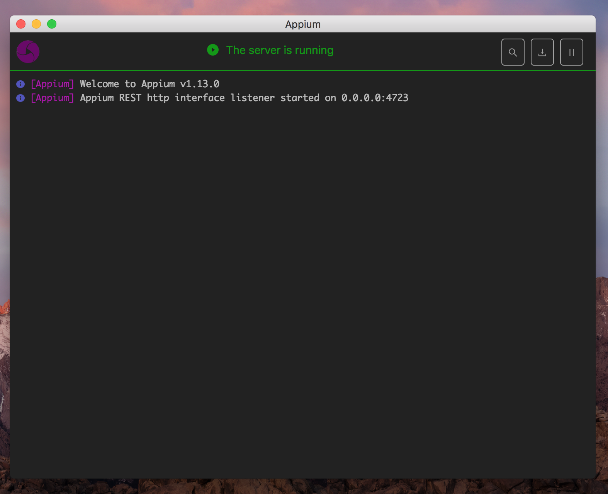
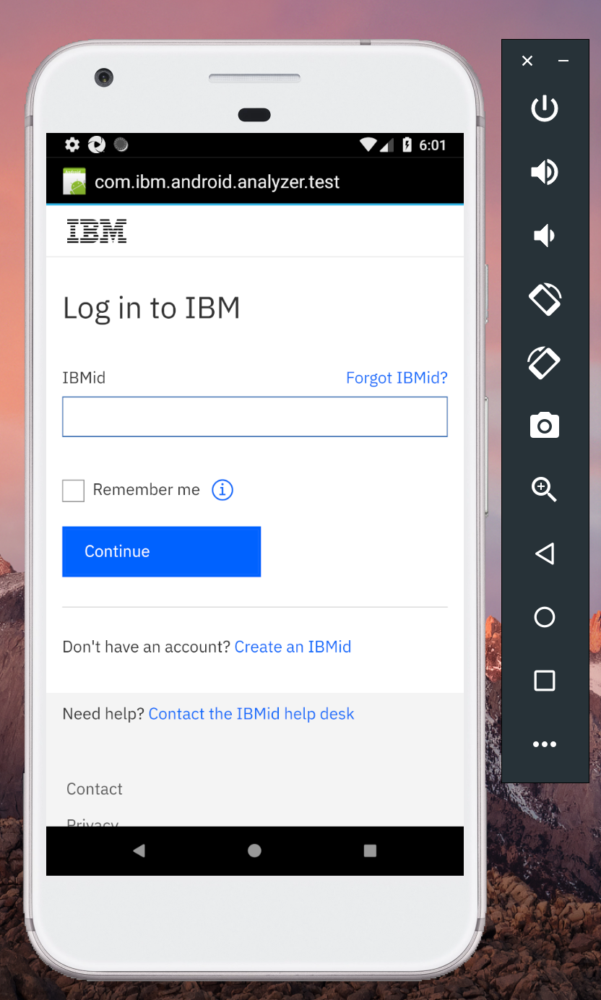

# Automation Testing with Appium

This is an example that showcase how to use [Appium](http://appium.io/) for Mobile app automation testing.

[IBM](https://www.ibm.com/) has a (free) [Mobile Analyzer](https://www.ibm.com/support/knowledgecenter/en/SSYJJF_1.0.0/ApplicationSecurityonCloud/appseccloud_results_samplescans.html) app that we will use for this demo.

**DISCLAIMER:** I DON'T KNOW IF THE APP CONTAINS VIRUSES, 
SO USE AT YOUR OWN RISK:speak_no_evil:

##### Usage
Download the [Appium](http://appium.io/) server, 
I am using version [1.13.0](https://github.com/appium/appium-desktop/releases/tag/v1.13.0) 
for this demo. The client script is written in [Python](https://www.python.org/), 
so make sure you have [Python](https://www.python.org/) setup.

What you should have:

:point_up: Android Emulator is running..


**Install required package**:

(recommended): *setup [pipenv](https://pipenv.readthedocs.io/en/latest/), [virtualenv](https://virtualenv.pypa.io/en/latest/) or [virtualenvwrapper](https://virtualenvwrapper.readthedocs.io/en/latest/)*

```
$> cd {APP_DIRECTORY} && pip install -r requirements.txt
```

Before anything, set the below on the [Appium server](https://github.com/appium/appium-desktop/releases):
```java
JAVA_HOME
ANDROID_HOME
```


- Configure server

- Start your server


**Run test(s)**:
```
$> py.test
```

###### What we intend to do or automate:

*We will access the app, navigate through the profile, and access
the login page*, that's all:smile:, it's that simple:yum:





#### Some cool articles
- [Appium + React Native quickstart](https://chase-seibert.github.io/blog/2017/01/06/appium-react-native-quickstart.html)
- [Finding Android components with Appium](https://medium.com/@iiroalhonen/finding-android-components-with-appium-107d3ce2e344)
- [Pytest - guide](http://doc.pytest.org/en/latest/usage.html)
- [Appium + example tests](https://github.com/appium-boneyard/sample-code/tree/master/sample-code/examples)
